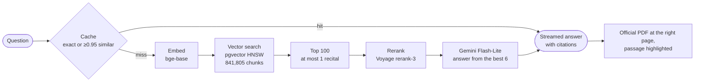

# RAG over EU Law

[](https://github.com/mostafaelsayed2002/rag-at-scale/actions/workflows/ci.yml)
[](https://github.com/mostafaelsayed2002/rag-at-scale/actions/workflows/cd.yml)
[](https://rag.elsayed2002.tech)

A production-level RAG system over all EU law in force. Ask a question in plain English; the answer is grounded in the official texts, every claim is cited, and a citation opens the official PDF at the right page with the passage highlighted.

**Try it:** https://rag.elsayed2002.tech · **Overview (PDF):** [docs/showcase/rag-at-scale.pdf](docs/showcase/rag-at-scale.pdf)


## At a glance

| | |
|---|---|
| Corpus | **40,183** EU legal documents → **841,805** chunks |
| RAGAS (100 golden questions) | faithfulness **0.98** · answer relevancy **0.85** · context recall **0.75** · context precision **0.69** |
| Right passage among the 6 the model reads (Hit@6) | **39% → 80%** with recital cap and reranking |
| Vector search | **12 ms** with an HNSW index, instead of 5.6 s exact search, at 99% recall |
| Live latency | first words **1.4 s**, whole answer **2.1 s** (p50), **76 ms** from cache |
| Development cost | **€3.46** in total |

## How it works



**Offline** (`ingest/`): the list of EU acts in force → each act's HTML from the Publications Office (CELLAR) → chunks by legal structure → each chunk's PDF page found once → embeddings on a free GPU → PostgreSQL with an HNSW index.

**Online** (`api/`, `web/`): FastAPI answers over Server-Sent Events; a Next.js app streams the text, lists the sources and opens the PDF viewer at the cited passage.

---

## What I built, and how each step was measured

Every change was tested on a golden set of 110 questions before it shipped. Retrieval is scored with **Hit@6**: is the right passage among the 6 results the model reads?

### 1. Chunking: by legal structure, not by size

EU laws are made of articles, recitals and annexes. The first version cut PDFs with a recursive splitter; the second reads the structure from the EUR-Lex HTML.

| | Version 1 | Version 2 (live) |
|---|---|---|
| Source | 43,106 PDFs | 40,183 HTML documents |
| Method | Recursive splitting, ~1,600 characters, 200 overlap | One chunk per article, recitals in small groups, annexes |
| Chunks | 1,062,613 | 841,805 |
| Hit@6 on a 2,968-document test set | 32% (351,858 chunks) | **46%** (330,850 chunks) |

The test set compares the two fairly: same documents, same embedding model, only the chunking differs. Every chunk starts with a header naming its place in the law, for example `Regulation (EC) No 261/2004 … | Article 7 Right to compensation`. Long articles are split at their numbered paragraphs (max 480 tokens, the embedding model reads 512); tables of numbers in annexes are skipped.

### 2. Embedding: a free model, so re-chunking stays free

| Option | Cost for 841,805 chunks |
|---|---|
| gemini-embedding-2, free tier | about **2.3 years** at 1,000 embeddings a day |
| gemini-embedding-2, paid | **~$55** per full embedding (~274M tokens at $0.20 / 1M) |
| bge-base-en-v1.5 on Kaggle's free GPUs (chosen) | **$0**, about an hour |

Gemini's model is more accurate, but every new chunking means embedding everything again. I kept the free model and improved the other steps instead. Questions are embedded on the server's CPU in ~0.1 s, with no quota. In a test of five models (bge-base, e5-large, bge-large, bge-m3, voyage-law-2), bigger free models added 4–6 points: not worth re-embedding.

### 3. Vector database: PostgreSQL + pgvector with an HNSW index

Comparing a question with every vector is exact but slow. An HNSW index walks a graph to the nearest vectors instead. Benchmark: 100 questions on the first, 1.06M-chunk version (`benchmarks_hnsw/`).

| | Exact search | HNSW (m 16, ef_construction 64, ef_search 160) |
|---|---|---|
| p50 / p95 | 5.6 s / 23.5 s | **12 ms / 34 ms** |
| recall@10 vs exact | 1.000 | **0.990** |

| ef_search | 10 | 20 | 40 | 80 | **160** | 320 | 640 |
|---|---|---|---|---|---|---|---|
| recall@10 | 0.75 | 0.87 | 0.93 | 0.97 | **0.99** | 0.993 | 0.993 |

Recall stops improving at 160. Vectors are stored as `halfvec` (16-bit, half the size); the index (1.6 GB for 841,805 vectors, built in 14 minutes) is kept in memory with `shared_buffers` and `pg_prewarm`. The app uses ef_search 400, because it fetches 300 rows to fill 100 candidates after the recital cap.

### 4. Retrieval quality: recitals and reranking

Reading the misses one by one showed the search usually found the right law, then picked the wrong paragraph. **Recitals** (the "whereas" text that explains *why* a law exists) are written in plain words, so they sound like questions and beat the articles with the actual rules. They are 30% of all chunks.

Hit@6 over all 841,805 chunks:

| Setup | Hit@6 |
|---|---|
| Vector search alone | 0.39 |
| + at most 1 recital among the results | 0.44 |
| + local cross-encoder (bge-reranker-base) on the top 20 | 0.56 |
| + Voyage rerank on the top 100 | **0.80** |

Vector search finds the right passage somewhere in its top 100 for 94% of questions; the reranker reads question and passage together and moves it into the top 6 for 80%. The local reranker read only 256 tokens per chunk and needed 1.3 s for 20 candidates on CPU. Voyage rerank-3 and rerank-2.5 score the same Hit@6 (0.80); rerank-3's first 200M tokens are free (~5,000 questions).

### 5. Caching: fast answers, lower cost

Two levels in Redis. A cached answer skips search, reranker and Gemini, so it costs nothing.

- **Exact:** the same question (and settings) again: **76 ms**.
- **Semantic:** a near-identical question, at cosine similarity ≥ 0.95: **201 ms**.

Why 0.95, measured on 22 paraphrase pairs and 20 pairs of different legal questions:

| Threshold | Paraphrases reused | Wrong answers served |
|---|---|---|
| 0.85 | 8/22 | 9/20 |
| 0.90 | 4/22 | 6/20 |
| 0.95 | 3/22 | **0/20** |

"Minimum wage in Germany in **2026**" and "in **2025**" are 0.93 similar but have different answers; in law, one word changes the answer.

### 6. Citations you can check

Each claim carries a number; the source opens in the official PDF at the right page with the passage highlighted. HTML has no pages, so every chunk's text was located in its act's PDF once. Highlights land on 20 of 20 sampled pages (7 of 20 before the search header was left out of the quote).

### 7. Serving and observability

- **Streaming:** `POST /chat/stream` sends Server-Sent Events (`token`, `done` with citations and costs, `error`); the first words appear after 1.4 s.
- **LangSmith:** every step of every answer is traced (embed, retrieve, rerank, generate) with its input, output, time and tokens.
- **Analytics page:** every request is stored with per-step timings; the dashboard shows p50 / p90 / p95 latency, the latency distribution, time per step, cache hit rate, error rate, tokens, cost, requests per hour and the slowest queries, over 1 h / 24 h / 7 d.
- **Resilience:** if the reranker or Redis is unreachable, the request still runs (vector order, no cache); 10 questions a minute per IP.

### 8. CI/CD

- **CI** on every pull request: builds the API and web images.
- **CD** on every merge to `main`: builds ARM images on a native ARM runner, pushes them to ghcr.io, deploys over SSH to an Oracle Cloud ARM server (Docker Compose behind Caddy with automatic HTTPS) and checks the site responds. About 5 minutes; secrets live only in GitHub.

---

## Evaluation

- **Golden set** (`eval/golden.jsonl`): 110 questions across ~20 areas of EU law. 100 have a verified reference answer and gold passage (`eval/gold_texts.json`); 10 are out of scope (e.g. "What is the speed limit on German motorways?").
- **Retrieval** (`eval/retrieve_eval.py`): Hit@k and MRR through the app's own retriever and reranker. A chunk counts when it comes from a gold act and shares 120+ letters in a row with the gold passage, so re-chunking does not break the test. Free: no LLM.
- **End to end** (`eval/ragas_eval.py`): RAGAS with Gemini as the judge.

| RAGAS | First full run | Now |
|---|---|---|
| Faithfulness | 0.84 | **0.98** |
| Answer relevancy | 0.67 | **0.85** |
| Context recall | 0.36 | **0.75** |
| Context precision | 0.31 | **0.69** |

- **Live** (`eval/live_bench.py`): 170 requests from a laptop to the deployed site, network included, 0 failures.

| Pass | First words p50 / p95 | Whole answer p50 / p95 / p99 |
|---|---|---|
| 110 golden questions, fresh | 1.4 s / 2.0 s | 2.1 s / 3.0 s / 3.7 s |
| 30 repeated: exact cache | 73 ms / 167 ms | 76 ms / 168 ms / 236 ms |
| 30 re-typed: semantic cache | 199 ms / 275 ms | 201 ms / 276 ms / 363 ms |

```bash
uv run --project api python eval/retrieve_eval.py
uv run --project api --group eval python eval/ragas_eval.py answer
uv run --project api --group eval python eval/ragas_eval.py score
uv run --project api python eval/live_bench.py https://rag.elsayed2002.tech
```

## Cost

| Item | Cost |
|---|---|
| RAGAS evaluation after each change (Gemini) | €3.46 |
| Oracle Cloud free tier: ARM server, 2 cores, 11 GB | €0 |
| Voyage rerank-3: 200M free tokens | €0 |
| Embedding all chunks: open model on a free GPU | €0 |
| **Total development cost** | **€3.46** |

## Run it locally

Needs Docker, [uv](https://docs.astral.sh/uv/), a Gemini API key and a Voyage AI API key.

```bash
cp .env.example .env            # add GOOGLE_API_KEY and VOYAGE_API_KEY
docker compose up -d            # Postgres, Redis, API, web on http://localhost:3000
```

The database starts empty. Building the corpus (once; every step resumes where it stopped, and embedding is meant for a GPU, e.g. Kaggle):

```bash
uv run --package rag-ingest python ingest/download.py          # list of acts in force + their PDFs
uv run --package rag-ingest python ingest/download_html.py     # their HTML from CELLAR
WORK_NAME=work_v2 uv run --package rag-ingest python ingest/rechunk.py
python ingest/pages.py --chunks data/eurlex/work_v2/chunks --pdf data/eurlex/pdf --out data/eurlex/pages.json
WORK_NAME=work_v2 uv run --package rag-ingest python ingest/fill_pages.py data/eurlex/pages.json
python ingest/embed.py --work data/eurlex/work_v2              # on a GPU
WORK_NAME=work_v2 uv run --package rag-ingest python ingest/ingest.py load
```

## Repository

```
api/              FastAPI: retrieval, reranking, generation, caches, SSE, analytics
web/              Next.js: chat, streaming, sources, PDF viewer with highlights, analytics
ingest/           EUR-Lex download, HTML chunker, PDF page finder, embedding, loading
eval/             golden set; retrieval, RAGAS and live benchmarks with their results
benchmarks_hnsw/  exact search vs HNSW, ef_search sweep
db/               SQL migrations (schema, request log, HNSW index)
docs/showcase/    the overview PDF and the screenshot above
```

## Limitations

- About 7% of acts exist only as PDF (e.g. the original REACH regulation) and are left out.
- The corpus holds acts as published, not consolidated versions: an amended article and its amendment are separate documents.
- Answers sometimes refer to an article ("compensation in accordance with Article 7") instead of stating its figures, even when that article is among the sources.
- 2 of the 10 out-of-scope questions get an answer to a nearby question instead of a refusal.
- The golden set is my own (built with an LLM, answers checked against the source text): a regression test, not a public benchmark.
- CI builds and deploys but does not run the evaluation: the 841,805-chunk database is too large for a CI runner. The evaluation runs on demand with the scripts above.

## Stack

Python · FastAPI · PostgreSQL + pgvector (HNSW) · Redis · sentence-transformers (bge-base-en-v1.5) · Voyage AI rerank-3 · Gemini Flash-Lite · LangChain · RAGAS · LangSmith · Next.js · Tailwind · react-pdf · Docker · Caddy · GitHub Actions · Oracle Cloud (ARM)
