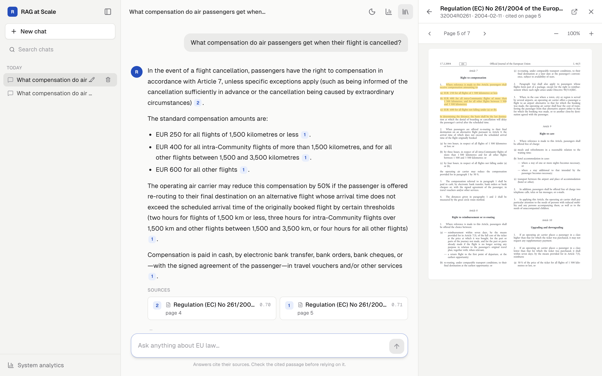
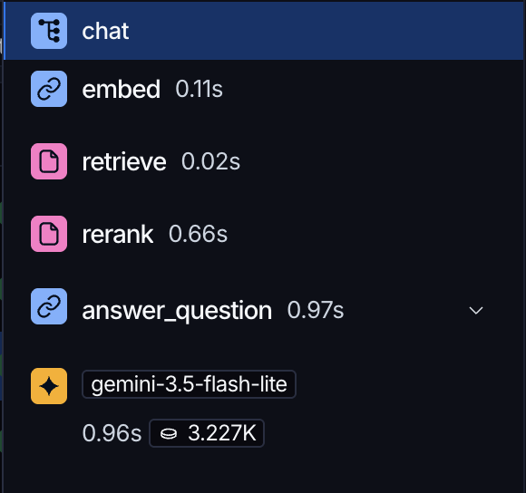

<div align="center">

# RAG over EU Law

**Production-level RAG over all EU law in force.**
Ask anything about EU law. The answer is grounded in the official texts, every claim is cited,
and a citation opens the official PDF with the passage highlighted.

[](https://rag.elsayed2002.tech)
[](https://youtu.be/ERD1HDcio6E)
[](docs/showcase/rag-at-scale.pdf)

[](https://github.com/mostafaelsayed2002/rag-at-scale/actions/workflows/ci.yml)
[](https://github.com/mostafaelsayed2002/rag-at-scale/actions/workflows/cd.yml)

</div>

---

## Contents

1. [Overview](#overview)
2. [The app](#the-app)
3. [Chunking](#chunking)
4. [Embedding and vector database](#embedding-and-vector-database)
5. [Retrieval quality](#retrieval-quality)
6. [Production](#production)
7. [Getting started](#getting-started)

---

## Overview

| 📚 EU legal documents | 🧩 Chunks |
|:---:|:---:|
| **40,183** | **841,805** |
| all EU law in force, from EUR-Lex | split by article and recital |

### RAGAS · 100 golden questions

| Metric | Score |
|---|:---:|
| Faithfulness | **0.98** |
| Answer relevancy | **0.85** |
| Context precision | **0.69** |
| Context recall | **0.75** |

### Features

`pgvector HNSW` · `LangChain + Gemini` · `Voyage rerank-3` · `Structure-aware chunking` · `Redis exact + semantic cache` · `SSE streaming` · `PDF citations with highlights` · `RAGAS evaluation` · `LangSmith tracing` · `Live analytics` · `Rate limiting` · `Docker + Caddy` · `GitHub Actions CI/CD`

### Development cost: **€3.46**

| Item | Cost |
|---|---:|
| RAGAS evaluation after each change | €3.46 |
| Oracle Cloud free tier · Ampere, 2 cores, 11 GB | €0 |
| Voyage rerank-3 · 200M free tokens, used in evaluation | €0 |
| Embedding all chunks · local model | €0 |

---

## The app

[](https://youtu.be/ERD1HDcio6E)

<p align="center"><b>▶ <a href="https://youtu.be/ERD1HDcio6E">Watch the 48-second demo</a></b></p>

### Answers backed by the actual law.



| The answer says | The law says |
|---|---|
| *"EUR 250 for all flights of 1,500 kilometres or less* **[1]**" | **Article 7** of Regulation 261/2004, opened in the official PDF at the cited page, with the passage highlighted |

**Live analytics:** every request is measured and stored. The dashboard shows p50 · p90 · p95 latency, latency distribution, time per step, cache hit rate, error rate, tokens in / out, cost per request, requests per hour, slowest queries and repeated questions, over 1 h · 24 h · 7 d.

---

## Chunking

### Chunk by legal structure, not by size.

#### 1. From PDFs to legal structure

| | Version 1 | Version 2 (live) |
|---|---|---|
| Source | 43,106 PDFs | 40,183 HTML documents |
| Method | Recursive splitting, ~1,600 characters, 200 overlap | One chunk per article and recital |
| Chunks | 1,062,613 | 841,805 |
| **Hit@6** | **32%** · on 2,968 test documents, 351,858 chunks | **46%** · same 2,968 documents, 330,850 chunks |

> **Hit@6:** the right passage is among the top 6 results. Same model, only the chunking differs.

#### 2. Every chunk knows where it is in the law

The Article 7 chunk behind the answer above:

```text
Regulation (EC) No 261/2004 … | Article 7 Right to compensation
1. Where reference is made to this Article, passengers shall receive compensation amounting to:
(a) EUR 250 for all flights of 1500 kilometres or less;
(b) EUR 400 for all intra-Community flights of more than 1500 kilometres, and for all other
    flights between 1500 and 3500 kilometres;
(c) EUR 600 for all flights not falling under (a) or (b). …
```

- **Articles:** one chunk each. Long ones are split at their numbered paragraphs (max 480 tokens).
- **Recitals:** a few per chunk (max 250 tokens), labelled like "Recitals (14)-(15)".
- **Tables of numbers** in annexes are skipped: they match no question.

---

## Embedding and vector database

### 841,805 vectors: embedded for free, searched in milliseconds.

#### 1. Embedding

Turning 841,805 chunks into vectors:

| gemini-embedding-2 · free tier | gemini-embedding-2 · paid | **bge-base · chosen** |
|:---:|:---:|:---:|
| **2.3 years** | **~$55** | **$0 · 1 hr** |
| 1,000 per day | every re-embedding | free Kaggle GPU |

> Gemini is more accurate, but every new chunking means paying again. So I kept the free model and improved the other steps.

#### 2. Vector database: building HNSW

PostgreSQL + pgvector, so a question isn't compared with every vector.

| Without an index | With the HNSW index | |
|:---:|:---:|:---:|
| **5.6 s** | **12 ms** | **460× faster** |
| compares the question with every vector | walks a graph to the nearest ones | 99% the same results |

**Tuning the index:** accuracy (recall@10) vs neighbours checked (ef_search).

| ef_search | 10 | 20 | 40 | 80 | **160** | 320 | 640 |
|---|---|---|---|---|---|---|---|
| recall@10 | 75% | 87% | 93% | 97% | **99%** | 99% | 99% |

- Built in **14 minutes**
- **1.6 GB**, kept in memory
- **16-bit** vectors: half the size

---

## Retrieval quality

### Finding the right passage.

#### 1. Reranking

Hit@6 over all 841,805 chunks: right passage among the 6 results the model reads.

| Step | What it does | Hit@6 |
|---|---|:---:|
| Vector search alone | the 6 chunks closest in meaning | 39% |
| + at most 1 recital | recitals explain why a law exists; they crowded out the rules | 44% |
| + local reranker, top 20 | a small model re-reads the best 20 with the question | 56% |
| **+ Voyage rerank-3, top 100** | a stronger model re-reads the best 100 | **80%** |

> Vector search finds the right passage somewhere in its top 100 for **94%** of questions. The reranker moves it into the top 6 for **80%**.

#### 2. How the system was measured

- **110 golden questions** with verified answers, 10 of them out of scope
- **Hit@6** after every change: free, no LLM needed
- **RAGAS** with an LLM judge for the final answers

---

## Production

### Running it for real.

#### 1. Caching: fast answers, lower cost

Measured live, from outside, over 170 requests:

| First words | Full answer | Same question | Similar question |
|:---:|:---:|:---:|:---:|
| **1.4 s** | **2.1 s** | **76 ms** | **201 ms** |
| streamed as written | median | exact · $0 | semantic · $0 |

> A cached answer skips search, reranker and Gemini: it costs nothing. Similar questions are reused only at **≥ 0.95** similarity ("wage in 2026" vs "2025" is 0.93).

#### 2. CI/CD pipeline

GitHub Actions · every merge to main goes live in ~5 minutes.

| Stage | Steps |
|---|---|
| **CI** | Pull request → build both images |
| **CD** | Merge to main → ARM images pushed to ghcr.io → Oracle Cloud pulls and restarts → live on HTTPS with a health check |

#### 3. Observability

Every step of every answer is logged in LangSmith. We can see each step's **input** and **output**.



---

## Getting started

Needs Docker, [uv](https://docs.astral.sh/uv/), a Gemini API key and a Voyage AI API key.

```bash
cp .env.example .env     # add GOOGLE_API_KEY and VOYAGE_API_KEY
docker compose up -d     # Postgres, Redis, API and web on http://localhost:3000
```

<details>
<summary>Building the corpus (the database starts empty)</summary>

Every step resumes where it stopped; embedding is meant for a GPU (e.g. Kaggle).

```bash
uv run --package rag-ingest python ingest/download.py          # acts in force + their PDFs
uv run --package rag-ingest python ingest/download_html.py     # their HTML from CELLAR
WORK_NAME=work_v2 uv run --package rag-ingest python ingest/rechunk.py
python ingest/pages.py --chunks data/eurlex/work_v2/chunks --pdf data/eurlex/pdf --out data/eurlex/pages.json
WORK_NAME=work_v2 uv run --package rag-ingest python ingest/fill_pages.py data/eurlex/pages.json
python ingest/embed.py --work data/eurlex/work_v2              # on a GPU
WORK_NAME=work_v2 uv run --package rag-ingest python ingest/ingest.py load
```

</details>

<details>
<summary>Running the evaluation</summary>

```bash
uv run --project api python eval/retrieve_eval.py                     # Hit@k and MRR, free (no LLM)
uv run --project api --group eval python eval/ragas_eval.py answer    # answer the golden questions
uv run --project api --group eval python eval/ragas_eval.py score     # RAGAS, Gemini as the judge
```

</details>

### Project structure

```
api/               FastAPI: retrieval, reranking, generation, caching, streaming, analytics
web/               Next.js: chat, sources, PDF viewer with highlights, analytics page
ingest/            download, chunking, PDF page matching, embedding, loading
eval/              golden set (110 questions) and evaluation scripts
benchmarks_hnsw/   exact search vs HNSW
db/                SQL migrations
```
